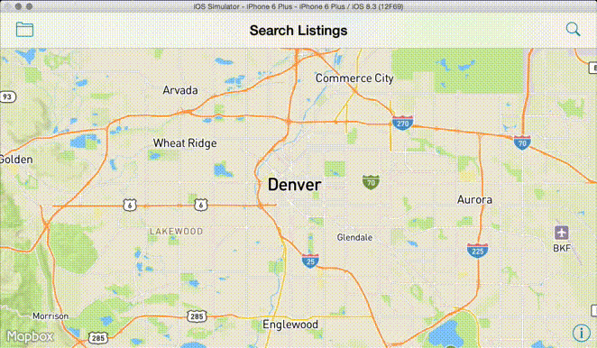

# WWDSee

Quickly put-together demo of some Mapbox integrations for our WWDC '15 party demo. 

App idea conceived 8pm Sunday, coded in < 6 hours, and presented at 6pm Monday; don't judge. 

Makes use of: 

 * [Mapbox GL](https://github.com/mapbox/mapbox-gl-native)
 * [Mapbox styles](https://github.com/mapbox/mapbox-gl-styles)
 * [Turf.js](http://turfjs.org) via [JavaScriptCore](http://nshipster.com/javascriptcore/)
 * [MapboxGeocoder.swift](https://github.com/mapbox/MapboxGeocoder.swift)
 * [MapboxDirections.swift](https://github.com/mapbox/MapboxDirections.swift)
